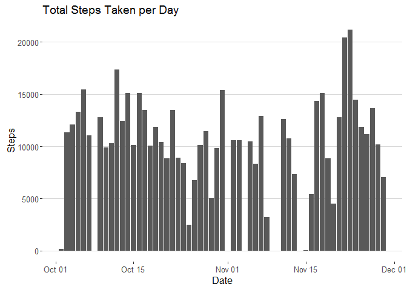
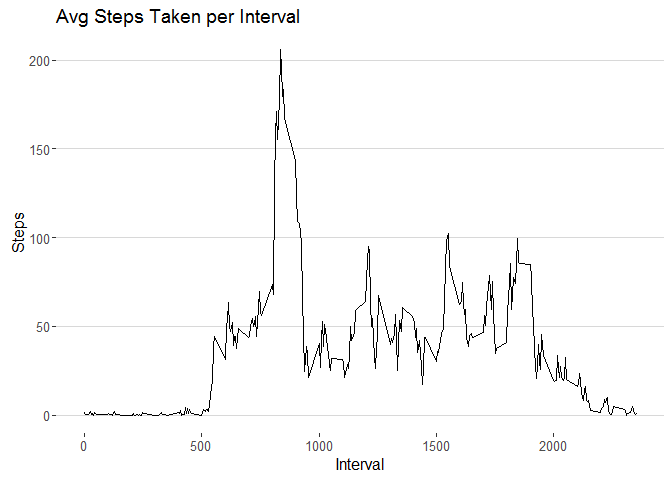
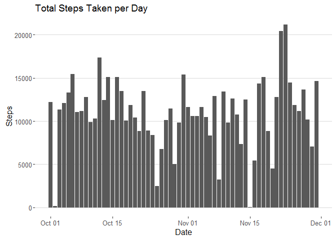
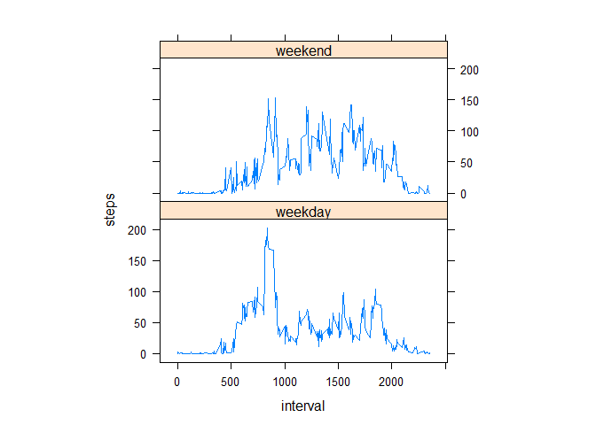

# Reproducible Research: Peer Assessment 1
## Initializaion

```r
library(readr)
library(ggplot2)
library(ggthemes)
library(lattice)
library(magrittr)
library(dplyr)
library(mice)
```


## Loading and preprocessing the data

1. Load the data (i.e. `read.csv()`)

```r
activity <- read_csv('Data/activity.csv')
```


2. Process/transform the data (if necessary) into a format suitable for your analysis

```r
activity$day <- weekdays(activity$date, abbreviate = T)
activity$day %<>% as.factor()
```


## What is mean total number of steps taken per day?
Ignore missing values while answering the next two questions.

1. Make a histogram of the total number of steps taken each day

```r
ggplot(activity, aes(x = date, y = steps)) +
  geom_bar(stat = "identity") +
  xlab("Date") + ylab("Steps") +
  ggtitle("Total Steps Taken per Day") + 
  theme_hc() + scale_colour_hc()
```

<!-- -->

2. Calculate and report the **mean** and **median** total number of steps taken per day

```r
mean(activity$steps, na.rm = T)
```

```
## [1] 37.3826
```
The ***mean*** number of steps taken per day is 37.3825996 steps.


```r
median(activity$steps, na.rm = T)
```

```
## [1] 0
```
The ***median*** number of steps taken per day is 0 steps.

## What is the average daily activity pattern?

1. Make a time series plot (i.e. `type = "l"`) of the 5-minute interval (x-axis) and the average number of steps taken, averaged across all days (y-axis)

```r
avg_steps_interval <-
  activity %>%
  group_by(interval) %>%
  summarise(mean_steps = mean(steps, na.rm = T))

ggplot(avg_steps_interval, aes(x = interval, y = mean_steps)) +
  geom_line(stat = "identity") +
  xlab("Interval") + ylab("Steps") +
  ggtitle("Avg Steps Taken per Interval") +
  theme_hc() + scale_colour_hc()
```

<!-- -->

2. Which 5-minute interval, on average across all the days in the dataset, contains the maximum number of steps?

```r
avg_steps_interval %$%
  interval[which.max(mean_steps)]
```

```
## [1] 835
```
**Interval 835**, on average, contains the maximum number of steps.


## Imputing missing values

The dataset contains a number of days/intervals where there are missing
values (coded as `NA`). The presence of missing days may introduce
bias into some calculations or summaries of the data.

1. Calculate and report the total number of missing values in the dataset (i.e. the total number of rows with `NA`s)

```r
sum(colSums(is.na(activity)))
```

```
## [1] 2304
```
There are **2304 rows** containing `NA` values.

2. Devise a strategy for filling in all of the missing values in the dataset. The strategy does not need to be sophisticated. For example, you could use the mean/median for that day, or the mean for that 5-minute interval, etc.

- Use the **MICE** package to impute the dataset. Use the **pmm** method to create 5 prospective datasets (**m = 5**); allow 50 iterations for each prospect (**maxit = 50**)

```r
library(mice)
activity$interval %<>% as.numeric()
activity$steps %<>% as.numeric()
imp3 <- mice(activity[,c(1,3)], m = 5, method = "pmm", maxit = 50, seed = 121)
```


3. Create a new dataset that is equal to the original dataset but with the missing data filled in.

```r
imp_activity <- activity
imp_activity[,c(1,3)] <- complete(imp3, 2)
```


4. Make a histogram of the total number of steps taken each day and Calculate and report the **mean** and **median** total number of steps taken per day. Do these values differ from the estimates from the first part of the assignment? What is the impact of imputing missing data on the estimates of the total daily number of steps?

```r
ggplot(imp_activity, aes(x = date, y = steps)) +
  geom_bar(stat = "identity") +
  xlab("Date") + ylab("Steps") +
  ggtitle("Total Steps Taken per Day") +
  theme_hc() + scale_colour_hc()
```

<!-- -->

```r
mean(imp_activity$steps)
```

```
## [1] 37.99687
```
The **mean** number of steps taken per day is 37.9968693.


```r
median(imp_activity$steps)
```

```
## [1] 0
```
The **median** number of steps taken per day is 0.
The **mean** and **median** values are virtually the same as their respective values before imputing missing data. This is not suprising, for the imputation method we choose ensures that the resulting summary statistics are not skewed relative to the prior metrics.

## Are there differences in activity patterns between weekdays and weekends?

For this part the `weekdays()` function may be of some help here. Use
the dataset with the filled-in missing values for this part.

1. Create a new factor variable in the dataset with two levels -- "weekday" and "weekend" indicating whether a given date is a weekday or weekend day.

```r
imp_activity$weekend <-  (imp_activity$day == 'Sat' | imp_activity$day == 'Sun')
imp_activity$weekend[imp_activity$weekend==T] <- 'weekend'
imp_activity$weekend[imp_activity$weekend==F] <- 'weekday'
imp_activity$weekend %<>% as.factor()
```


2. Make a panel plot containing a time series plot (i.e. `type = "l"`) of the 5-minute interval (x-axis) and the average number of steps taken, averaged across all weekday days or weekend days (y-axis). The plot should look something like the following, which was created using **simulated data**:

```r
xyplot(steps ~ interval | factor(weekend), 
       data = aggregate(steps ~ interval + weekend, imp_activity, mean), 
       aspect = 1/2, type = "l")
```

<!-- -->
